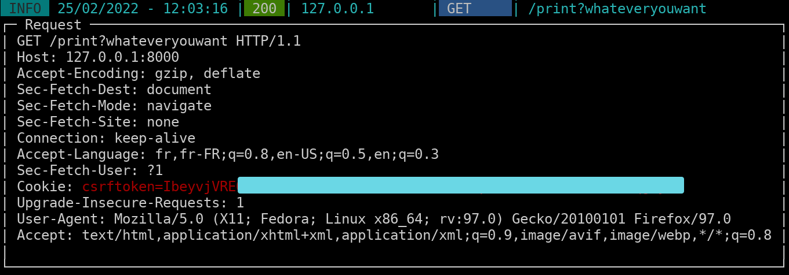

Simwigo is a cross-platform tool, written in Go, to simplify the deployment of a web service.

It is easy to use and user-friendly. It also implements features to facilitate file exchange.

The web service architecture is based on the powerful [Gin](https://github.com/gin-gonic/gin) framework. [Pterm](https://github.com/pterm/pterm) is used to provide a nice and neat display.

It implements simple security mechanisms to protect the exposure of the service, such as TLS, by automatically generating a TLS certificate using Let's Encrypt or by using personal certificates.
<br>This is not the case with efficient but not secure tools such as **SimpleHttpServer** or **http.Server** (python).

Moreover, for more security it is possible to use authentication by API tokens.

# Functionalities

* **/ping** : Ping the server to check if you can join him.
* **/print** : Print details of incoming requests (interesting when exploiting an XXS for example).
* **/file/upload** : To upload files.
* **/file/download/{filename}** : To download files.
* **/file/list** : List all available files.

# Usage
```
Usage:
  simwigo [OPTIONS]

Application Options:
      --autotls     Enable TLS using Let's Encrypt
      --self-cert   Auto generates self-signed TLS certificates (dangerous)
      --rsa         Force the use of RSA to generate TLS certificates (default=EDCSA)
  -a, --api         Enable authorization api key
      --no-debug    Disable Debug mode: no output
      --light       Light mode: disable colored mode
  -p, --port=       Port to listen (default: 8000)
  -i=               Interface to listen (default: 0.0.0.0)
      --cert=       Path to TLS certificate file
      --key=        Path to TLS KEY file
      --temp=       Path to a temporary directory
      --cache=      Path to a cache directory
      --dir=        Enable directory listing (dangerous)
  -d, --domain=     Domain to specify for Let's Encrypt
  -l, --white-list= White list IP separated by comma (,)
```

# Security

This tool was developed with security in mind, to keep the web server secure as possible.

## TLS
You can easily deploy a web server using TLS.

Below are the rules to enable TLS :

* By using `--autotls` option. This feature support Let's Encrypt (recommended).
* By using `--self-cert` option. This will automatically generate self-signed certificates. Please use it only on a lab network (not safe).
* By providing your own certificates.

## API
It is **highly recommended** to enable the `API` option. This feature will generate an API key that must be provided to access sensitive API routes.

## White listing

A white list system allows you to specify which IPs will be able to access the server and reject all requests from unknown IPs.

```go
simwigo --autotls --api --white-list 192.168.0.10,192.168.0.50,192.168.0.100
```

# Examples

## Upload file

```shell
curl https://127.0.0.1/file/upload -H "X-API-Key: XXXXXXXXXXXXXX" -F "file=@/tmp/test.txt"

# Windows PowerShell

req = New-Object System.Net.WebClient
$req.Headers.Add("X-API-Key", "XXXXXXXXXXXXXX")
$req.UploadFile("https://127.0.0.1/file/upload", ".\Desktop\file.txt")
```

## Download file

```shell
curl https://127.0.0.1/file/download/test.txt -H "X-API-Key: XXXXXXXXXXXXXX"

# Windows PowerShell

Invoke-WebRequest 'https://127.0.0.1:8000/file/download/test.txt' -Headers @{"X-API-Key" = "lhztfbMjNk7TbncxUebt"}
```
## Print incoming requests

When `print` api route is accessed, it will prompt the details:



# Cross Platform

Tested on Windows and Linux. But should also work on macOS.

# Getting tarted

Precompiled binaries (Windows/Linux/macOS) are available on the [Release page](https://github.com/8iche/simwigo/releases).

## Building
### Linux

```GO
go build -ldflags "-w -s" -o simwigo simwigo.go
```

### Windows

```GO
GOOS=windows GOARCH=amd64 go build -ldflags "-w -s" -o simwigo simwigo.go
```

# Todo

- [X] Authentication using API Key
- [X] Upload functionality
- [X] Download functionality
- [X] TLS implementation
  * Support Let's Encrypt
  * Self-signed certificates generation
  * Custom certificates
- [ ] Save logs to file
- [ ] Support configuration file
- [ ] Support multi-user authentication

# Features & Issues

Feel free to contact me by e-mail for improvement or addition of new features and for issues you encountered. 

# Credits

Anis Boubekri : a.boubekri@protonmail.com